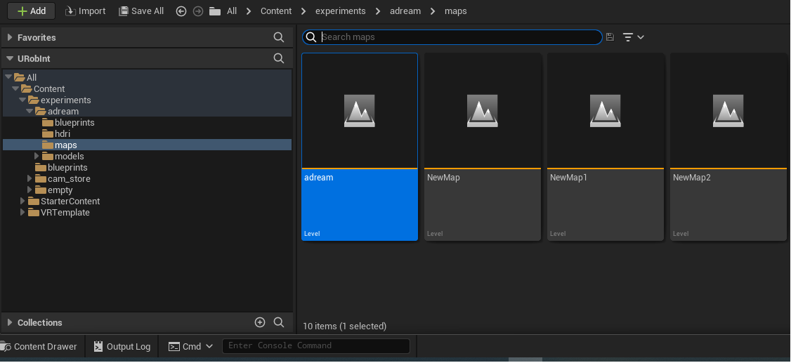
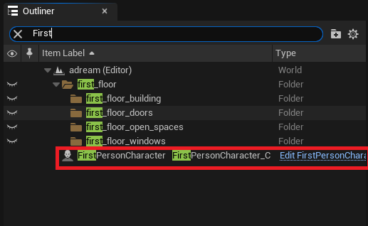
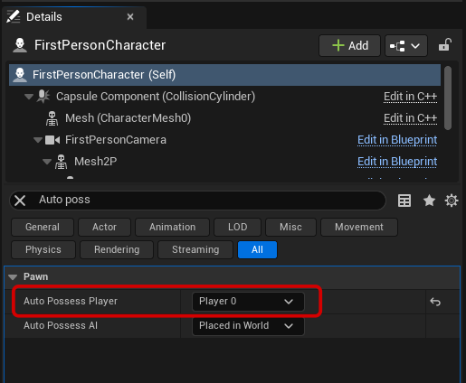

# URobInt

## How to use the project:

The 3 scripts that will be use are all present in the 'Script' folder in this project
***
### Use in Unreal 5.0 

> If you want to play the project in Virtual Reality, make take sure that your vr headset is ready and that steamvr is ready and connected to your vr device   
> 

#### **Load a Map**

If your map is not already loaded, open the 'content Drawer' bottom left, go to All->Content->experiments->name of the project you want to load->maps and then double click on the map with the same name as the project.
> exemple to load Adream map the path is : All>Content>experiments>adream>maps>adream
> 

#### **In first person**

#### *Controls:*
| input  | action          |
| :---------------: |:---------------:| 
| z,w,arrowUp  |   move Forward        |  
| s,arrowDown  | move Backward             |   
| q,a,arrowLeft  | move Left       |   
| d,arrowRight | move Right |
|e | interact (Open door) |

Select the 'FirstPersonCharacter' actor in your map (you can search it in the top right corner in 'Outliner')
> 

Once selected be sure to be on the composant 'FirstPersonCharacter (self)' (selected by default). Then in the search bar write player, there should be only one line name 'Auto Possess Player' set by default to 'Disabled', select 'Player 0'

>    

> It's is highly recommended to build before playing, to do so, go to the top bar, look for Build->Build all levels and white for it to be finished.   
> 

To play you just have to click the green play button at the top of the map, you may want to changes mode if you have use VR before back to 'Selected Viewport', to do so click the 3 dot next to the 
play button and select the mode, to leave the simulation press echap on your keyboard

> 

#### **In VR**

Be sure that the 'FirstPersonChracter' actor in your map 'Auto Possess Player' is set to 'Disabled' (it is by default, just if you use the first person mode don't forget to change it back).

Launch vive wireless, connect your vr headset to vive by following the instruction.

Once you are connected launch steam then steam vr, your headset should be detected by steam vr.

If you unreal project was open before vive, relaunch it.

On unreal if your map is not already loaded, open the 'content Drawer' bottom left, go to All->Content->experiments->name of the project you want to load->maps and then double click on the map with the same name as the project.

Click one the 3 dot next to the green play button on top of the map and select the mode VR Preview.

The game should launch by itself, to stop it press echap on your keyboard on the relaunch it use the green play button

### Export your blender

In Blender, go to 'scripting'(top bar) then in 'Text' (top bar of the text editor) select 'Open' and open the script 'export_from_blender.py'

If not already done, import the Yaml python package in blender(path: blender/version(3.2 or 2.4)/python/lib) and copy it here (there should be 3 folder 'yaml' , 'PyYAML-6.0.dist-info' , '_yaml')_

You may have to change the 'mesh_root_path' (line 6 of the script) to match the location you want and the name of the scene set to Adream by default (line 7) to match your scene name ( you can see scene name in the top right corner)

> You can hide categories before the export if you dont want to export them by excluding them from the viewlayer (case next to the categories name)
 or hiding them in viewport (eyes next to the categories name). You can't hide mesh from the export only categories and if you use camera in blender put them in categories and hide the categories before launching the script.

After that, use the 'run script' button (play button in the top bar) and all your meshes will be export in the fbx (and obj and stl) format

If there is an error saying that the yaml librairy is not found. Try to open the blender where you put in library in and then open the project you want to export instead of opening directly your project.

### Import your blender in Unreal

If you use the project from the git most of the parameters are already setted

Verify in the 'import_asset.py' script that in the main the path in 'importAssets()' is the one of your FBX folder creater by 'export_from_blender.py'

Put the name of your project in the 'import_asset.py' line 4 as the paramet of the scene_name 

In the bottom bar there should be a place where you can write and next to it a arrow oriented down with written 'Python' or 'Cmd' to its left. Modify the category to be python then write in the place next to it the path to your "import_asset.py" location (mine is D:\adream_models\scripts\import_asset.py)

### Recreate your blender in Unreal

Be sure to have imported the assets you want to use on the map before following this instruction, to do so look at the part "Import your blender in Unreal"

In the top left corner go to Edit->project settings then search for 'additional path' click on the '+' in the additional paths line and put the path to your 3 Yaml file
(I recommend you to use the script folder with the yaml file in the URobInt project as the path)

In the same place where you write "import_asset.py" path, write "import.py" path same for the scene_name they have to match. 

> Everytime a window asks you to name a map you can just press enter, it is highly recommended to select for the first map the folder of your maps: 'experience/'yourprojectname'/maps' to have a better organised project, for the other map the path will be keep in memory . Your whole scene should be create in different sub_level all being level of the map name after your project in the folder 'experience/'yourprojectname'/maps' in your content browser

To have the outline in VR, select the PosProcessVolume actor (you can search it in the top right corner in 'Outliner'), write array in the search bar for component. Add 3 differents array by clicking on the '+', set the all to Asset reference by clicking on choose then click on the none, a list of materials should open up, type outline in the search bar, you should have 3 different material showing up, put one to each array.

If you want to update the scene, just go to the 'empty' map in the maps folder. Delete all your level and sublevel of the scene and use the "import.py" script

